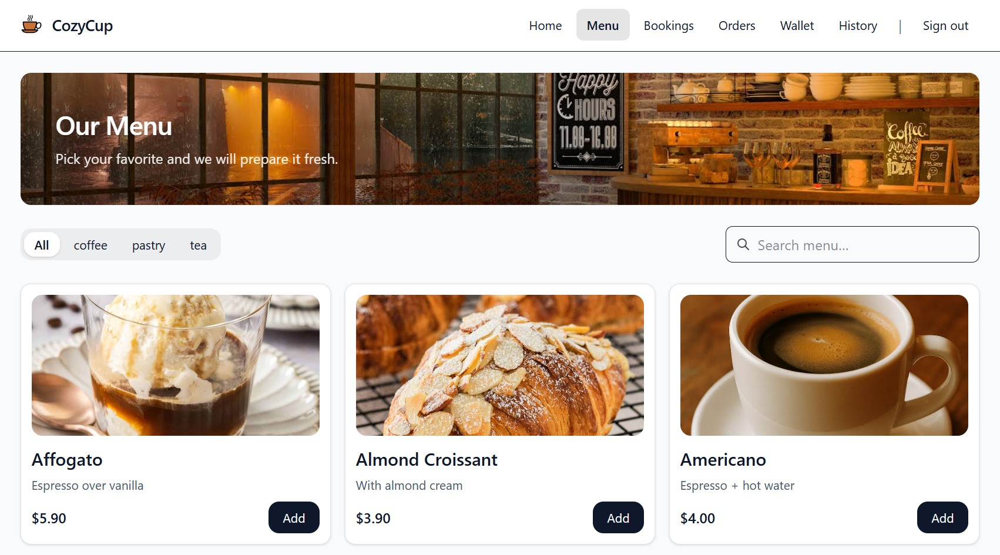
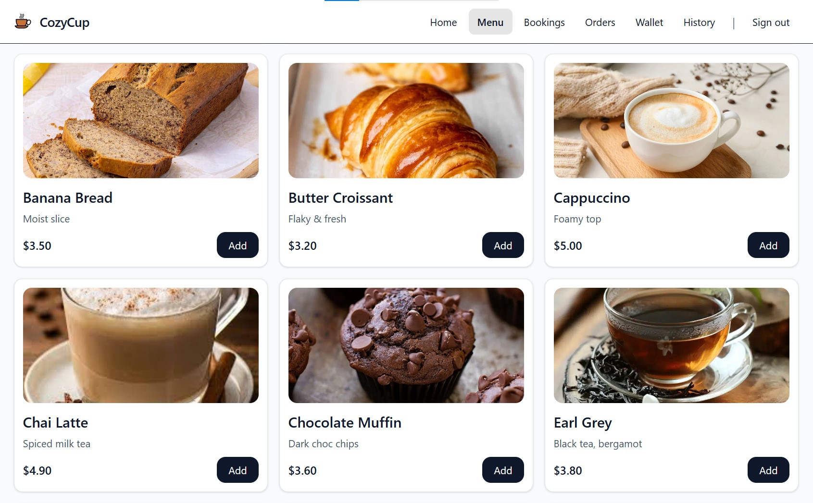

# ☕ CozyCup Frontend - Click · Collect · Coffee  
        Modern React Application for a Seamless Coffee-Shop Ordering Experience

<p align="center">
  
  
  
  
  
  
</p>

<p align="center">
  <em>A polished, production-grade frontend powering the CozyCup ordering platform.</em>
</p>

---

## 🌟 Overview

**CozyCup Frontend** is a complete, production-ready SPA built with **React + Vite**, designed for clarity, performance and delightful user experience.

What it provides ?

- Beautiful, fast UI built with **React, TailwindCSS & custom components**
- Full cart system + ordering workflow  
- Login/Signup flow connected to the production backend  
- Host tools for managing 
- Wallet, passes, QR-based check-ins  
- Full E2E test suite (Playwright) ensuring production stability  
- CI/CD pipeline + Docker image build  
- Fully deployed live on Render 🚀  

This frontend communicates with the backend via the environment variable:  
```
VITE_API_BASE_URL
```

---

## 🧠 Tech Stack

| Layer | Technology |
|-------|------------|
| **Framework** | React 18 |
| **Bundler** | Vite |
| **Styling** | TailwindCSS + Custom UI |
| **Routing** | React Router |
| **State Management** | Context API |
| **Testing** | Playwright (E2E), Vitest (unit/integration) |
| **Linting** | ESLint (custom config) |
| **CI/CD** | GitHub Actions |
| **Containerization** | Docker |
| **Deployment** | Render - Static Site |

---

## 🚀 Quick Start

### 🧩 Prerequisites
Install the following first:

- Node.js 20+
- Git
- CozyCup Backend running locally or on Render

---

### ⚙️ 1. Clone & Install

```bash
git clone https://github.com/Eladgel1/CozyCup-frontend.git
cd CozyCup-frontend
npm ci
```

---

## 🔐 2. Environment Setup

Create a `.env` file:

```bash
cp .env.example .env
```

Add:

```env
VITE_API_BASE_URL=http://localhost:3000
```

For production:

```env
VITE_API_BASE_URL=https://cozycup-backend.onrender.com
```

---

## ▶️ 3. Run Development Server

```bash
npm run dev
```

Runs at: `http://localhost:5173`

---

## 🧪 4. Testing

### Run All Unit/Integration Tests
```bash
npm test
```

### Run Playwright E2E Suite
```bash
npx playwright install
npm run test:e2e
```

---

## 🐳 5. Docker Usage

### Build Development Image
```bash
npm run docker:build:dev
```

### Run Development Container
```bash
npm run docker:run:dev
```

### Build Production Image
```bash
npm run docker:build:prod
```

### Run Production Image
```bash
npm run docker:run:prod
```

---

## 🛠️ CI/CD - GitHub Actions

Every push to `main` triggers:

✔ Install dependencies  
✔ Linting  
✔ Unit + Integration + E2E tests Run 
✔ Vite production build  
✔ Docker build  
✔ Artifact upload  
✔ Auto-deploy to Render  

---

## ☁️ Deployment - Render

The app is deployed as a **static site**.

Render config:

| Setting | Value |
|--------|-------|
| **Build Command** | `npm ci && npm run build` |
| **Publish Directory** | `dist` |
| **Environment Variable** | `VITE_API_BASE_URL=https://cozycup-backend.onrender.com/` |

Live Production URL:

```
https://cozycup-frontend.onrender.com
```

---

## 🎨 UI Preview

<p align="center">
  
  <br/><em>Homepage View</em>
</p>

<p align="center">
  
  <br/><em>Menu View #1</em>
</p>

<p align="center">
  
  <br/><em>Menu View #2</em>
</p>

---

## 📂 Project Structure

```bash
src/
├── assets/
├── components/
├── features/
├── lib/
├── pages/
├── styles/
├── App.jsx
├── main.jsx
├── routes.jsx

tests/
├── e2e/
├── fixtures/
├── functional/
├── integration/
├── msw/
├── unit/

test-results/
```

---

## 💡 Notes

- Vite handles bundling & HMR  
- All API requests rely on env variable  
- Docker image uses multi-stage build  
- CORS fully supported on backend  

---

## ✅ Final Notes

CozyCup Frontend is now:

✔ Fully tested  
✔ Docker-ready  
✔ Production deployed  
✔ CI/CD automated  
✔ Professionally structured  

Enjoy! ☕  
